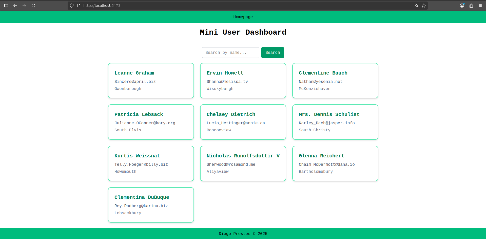

# Desafio Take Home Frontend

Este projeto é um desafio de frontend para fazer um mini dashboard de usuários.


## Imagem




## Como rodar o projeto

1. **Clone o repositório:**

  ```bash
  git clone https://github.com/Pwn3ed/desafio-take-home-frontend.git
  cd desafio-take-home-frontend
  ```

2. **Instale as dependências:**

  ```bash
  npm install
  ```

3. **Rode o projeto em modo desenvolvimento:**

  ```bash
  npm run dev
  ```

  O app estará disponível normalmente em `http://localhost:5173`.

4. **Rodar os testes:**

  ```bash
  npm test
  ```


## Tecnologias principais
- React
- TypeScript
- Vite
- TailwindCSS
- Vitest + Testing Library
- React Router DOM


## Roteamento

Este projeto utiliza [React Router DOM](https://reactrouter.com/) para navegação SPA. As rotas são configuradas em `src/main.tsx` usando `createBrowserRouter` e `RouterProvider`.

Rotas principais:
- `/` — Página inicial (`Home`)
- Rotas não encontradas ou erros — Página de erro (`Error`)


## Especificações
- Possui react hooks
- Possui loading spinner e tratamento de erro
- Possui teste simples
- Possui layout responsivo


---

Dúvidas? Entre em contato através do meu Github ou pelo Linkedin: https://linkedin.com/in/pwn3ed
